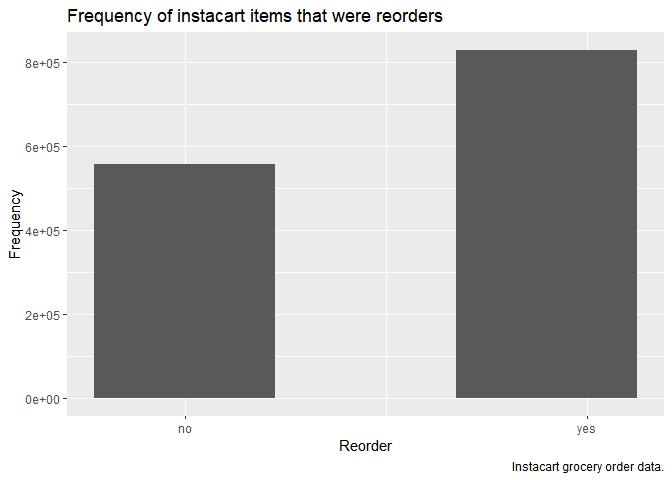

Homework 3
================
Kylie Wheelock Riley
10/14/2019

## Problem 1

The Instacart dataset has 1384617 rows of data for 131209 distinct
orders. There were 39123 unique products ordered in this dataset.
Bananas are the most popular item with 18726 orders. The top 10 items
ordered are listed below:

| product\_name          | count |
| :--------------------- | ----: |
| Banana                 | 18726 |
| Bag of Organic Bananas | 15480 |
| Organic Strawberries   | 10894 |
| Organic Baby Spinach   |  9784 |
| Large Lemon            |  8135 |
| Organic Avocado        |  7409 |
| Organic Hass Avocado   |  7293 |
| Strawberries           |  6494 |
| Limes                  |  6033 |
| Organic Raspberries    |  5546 |

60% of the items ordered were reorders.
<!-- -->

Last but not least, people waited on on average 17.07 days since their
last order to place the order in this dataset.

**1A) How many aisles are there, and which aisles are the most items
ordered from?**

There are 134 aisles at the Instacart warehouse. The most popular aisle
is Fresh Vegetables, and the top 5 aisles are listed below.

| aisle                      |  count |
| :------------------------- | -----: |
| fresh vegetables           | 150609 |
| fresh fruits               | 150473 |
| packaged vegetables fruits |  78493 |
| yogurt                     |  55240 |
| packaged cheese            |  41699 |

**1B) Make a plot that shows the number of items ordered in each aisle,
limiting this to aisles with more than 10000 items ordered. Arrange
aisles sensibly, and organize your plot so others can read it.**
<!-- -->

**1C) Make a table showing the three most popular items in each of the
aisles “baking ingredients”, “dog food care”, and “packaged vegetables
fruits”. Include the number of times each item is ordered in your
table.**

| aisle                      | product\_name                                 | count |
| :------------------------- | :-------------------------------------------- | ----: |
| baking ingredients         | Light Brown Sugar                             |   499 |
| baking ingredients         | Pure Baking Soda                              |   387 |
| baking ingredients         | Cane Sugar                                    |   336 |
| dog food care              | Snack Sticks Chicken & Rice Recipe Dog Treats |    30 |
| dog food care              | Organix Chicken & Brown Rice Recipe           |    28 |
| dog food care              | Small Dog Biscuits                            |    26 |
| packaged vegetables fruits | Organic Baby Spinach                          |  9784 |
| packaged vegetables fruits | Organic Raspberries                           |  5546 |
| packaged vegetables fruits | Organic Blueberries                           |  4966 |

**1D) Make a table showing the mean hour of the day at which Pink Lady
Apples and Coffee Ice Cream are ordered on each day of the week; format
this table for human readers (i.e. produce a 2 x 7 table).**

| product\_name    |   Sun |   Mon |   Tue |   Wed |   Thu |   Fri |   Sat |
| :--------------- | ----: | ----: | ----: | ----: | ----: | ----: | ----: |
| Coffee Ice Cream | 13.77 | 14.32 | 15.38 | 15.32 | 15.22 | 12.26 | 13.83 |
| Pink Lady Apples | 13.44 | 11.36 | 11.70 | 14.25 | 11.55 | 12.78 | 11.94 |

# Problem 2

**2A) In 2002, which states were observed at 7 or more locations? What
about in 2010?**

In 2002 there were 6 states observed at 7 or more loctions.

| state | number\_of\_locations |
| :---- | --------------------: |
| PA    |                    10 |
| MA    |                     8 |
| NJ    |                     8 |
| CT    |                     7 |
| FL    |                     7 |
| NC    |                     7 |

In 2010 there were 14 states observed at 7 or more locations.

| state | number\_of\_locations |
| :---- | --------------------: |
| FL    |                    41 |
| NJ    |                    19 |
| TX    |                    16 |
| CA    |                    12 |
| MD    |                    12 |
| NC    |                    12 |
| NE    |                    10 |
| WA    |                    10 |
| MA    |                     9 |
| NY    |                     9 |
| OH    |                     8 |
| CO    |                     7 |
| PA    |                     7 |
| SC    |                     7 |

**2B) Construct a dataset that is limited to Excellent responses, and
contains, year, state, and a variable that averages the data\_value
across locations within a state. Make a “spaghetti” plot of this average
value over time within a state**

<!-- -->

**2C) Make a two-panel plot showing, for the years 2006, and 2010,
distribution of data\_value for responses (“Poor” to “Excellent”) among
locations in NY State.**
<!-- -->

# Problem 3

**3A) Load, tidy, and otherwise wrangle the data. Your final dataset
should include all originally observed variables and values; have useful
variable names; include a weekday vs weekend variable; and encode data
with reasonable variable classes. Describe the resulting dataset
(e.g. what variables exist, how many observations, etc).**

The accelerometer dataset contains data for 5 weeks, and a total of 34
days. the data is summarized by an activity count (step count) per
minute of the day. There is a total of 50400 minutes in the dataset and
there are variables to indicate the day of week and whether it is a
weekday (y/n).

**3B) Traditional analyses of accelerometer data focus on the total
activity over the day. Using your tidied dataset, aggregate accross
minutes to create a total activity variable for each day, and create a
table showing these totals. Are any trends apparent?**

| day       |      1 |      2 |      3 |      4 |      5 |
| :-------- | -----: | -----: | -----: | -----: | -----: |
| Sunday    | 631105 | 422018 | 467052 | 260617 | 138421 |
| Monday    |  78828 | 295431 | 685910 | 409450 | 389080 |
| Tuesday   | 307094 | 423245 | 381507 | 319568 | 367824 |
| Wednesday | 340115 | 440962 | 468869 | 434460 | 445366 |
| Thursday  | 355924 | 474048 | 371230 | 340291 | 549658 |
| Friday    | 480543 | 568839 | 467420 | 154049 | 620860 |
| Saturday  | 376254 | 607175 | 382928 |   1440 |   1440 |

Daily values of activity range from 1440 to 685910. Most weekday data
have values in the 200000 to 400000 range. Saturdays seems to be the
laziest days with 2 weeks coming in at the 1440 activity level. (or this
is when they were charging the accelerometer?)

**3C) Accelerometer data allows the inspection activity over the course
of the day. Make a single-panel plot that shows the 24-hour activity
time courses for each day and use color to indicate day of the week.
Describe in words any patterns or conclusions you can make based on this
graph.**
<!-- -->

From this plot there are daily patterns that emerge. There are spikes in
activity around 7am, presumably waking up, 11-12pm, presumably lunch,
4-6pm, leaving work, and 8-10pm, perhaps running errands or getting in a
workout. I expected to see more distinct differences between weekends
and weekdays, but there is not a strong pattern that emerges, besides
the no movement Saturdays, which we saw in the previous table.
